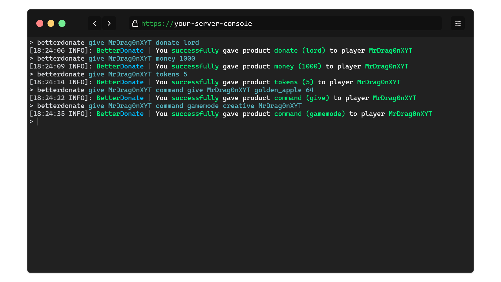
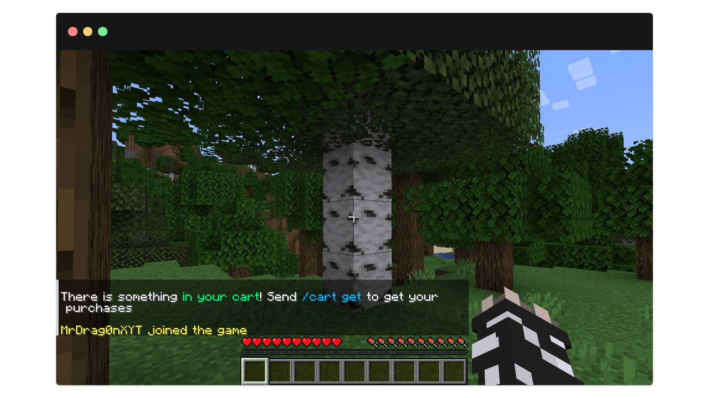
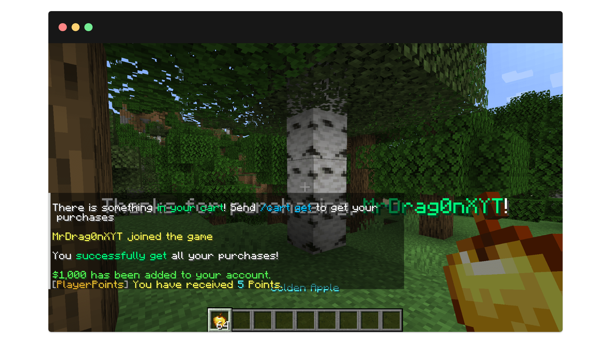
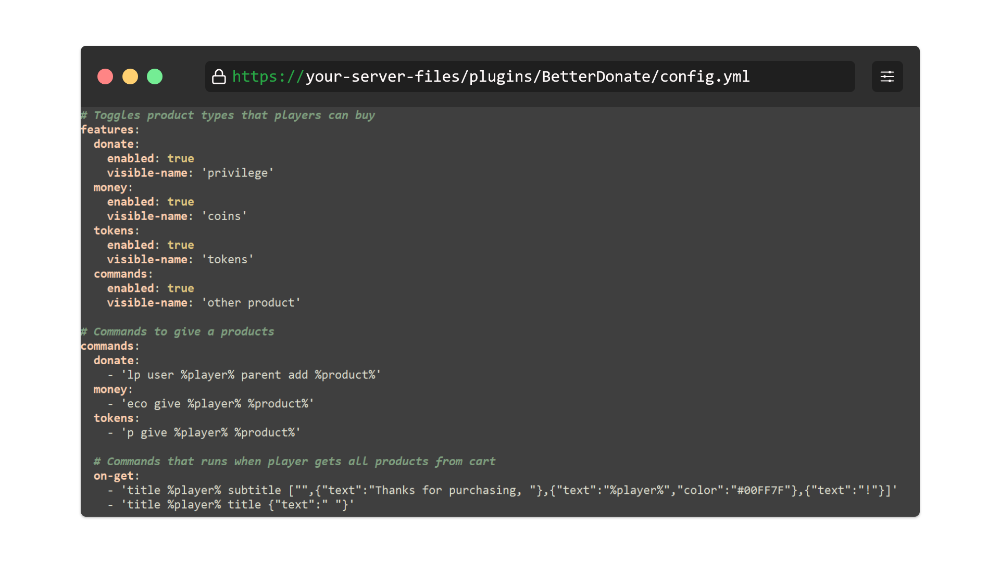
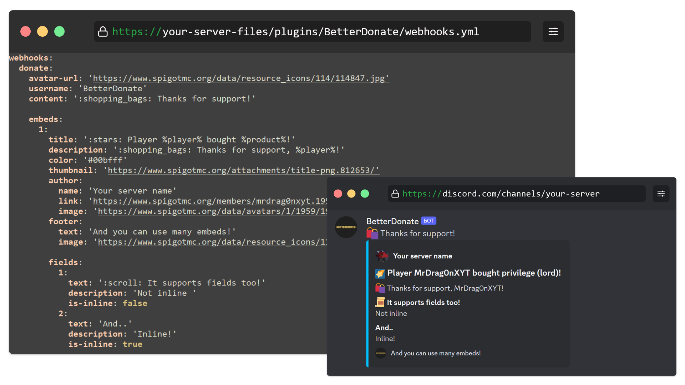

<div align="center">
<h5></h5>
</div>

**BetterDonate** - плагин для Spigot, который добавляет корзину покупок для игроков

<hr>

# [English version](README.md)

<hr>

# 🌠 Особенности
- [x] Поддержка разных видов товаров с настройкой команд для выдачи:
  - привилегия (например, LuckPerms)
  - деньги (например, Vault)
  - токены (например, PlayerPoints)
  - своих команд
- [x] Настройка команд при выдаче товара
- [x] Оповещение игрока о наличии покупок в корзине
- [x] Плейсхолдер с количеством покупок
- [x] Webhook-сообщение в Discord при покупке


<hr>
<br>

# 📷 Screenshots

Выдача одной командой


Оповещение игрока о наличии покупок при входе


Возможность забрать все покупки одной командой


Простой, но детальный конфиг плагина


Оповещение в Discord через вебхук при покупке



<hr>
<br>

# 🚀 Использование

## Команды:

### `/betterdonate` - основная команда плагина

> Право: **betterdonate.admin**

Список команд:

- `/betterdonate help` - показать список команд
- `/betterdonate reload` - перезагрузить плагин
- `/betterdonate clear <игрок>` - очистить корзину игрока
- `/betterdonate give <игрок> <тип товара> <аргумент>` - выдать товар игроку
  - Пример использования: `/betterdonate give Player123 donate vip`

### `/cart` - команда для игроков

> Право: **betterdonate.cart**

Список команд:

- `/cart help` - показать список команд
- `/cart get` - получить купленные товары

<br>

## 💾 Плейсхолдеры:
### **%betterdonate_purchases_count%** - возвращает количество покупок игрока

<br>

## 🛒 Товары:

### Список доступных товаров для выдачи:

- **привилегия (например, LuckPerms)**
  - Пример использования: `/betterdonate give Player123 donate vip`
- **деньги (например, Vault)**
  - Пример использования: `/betterdonate give Player123 money 1000`
- **токены (например, PlayerPoints)**
  - Пример использования: `/betterdonate give Player123 tokens 1`
- **любые свои команды**
  - Пример использования: `/betterdonate give Player123 give Player123 minecraft:diamond 64`

> [!TIP]
> Команды для выдачи настраиваются в [config.yml](src/main/resources/config.yml)

<hr>
<br>

# ⚙ Остальная информация

- Если вы нашли баг или хотите помочь в разработке - не стесняйтесь обращаться ко мне
  - Ссылки на контакты [тут](https://slv.nshard.fun/) 
- Также (по желанию) вы можете дать мне денег:
  - [DonationAlerts](https://www.donationalerts.com/r/mrdrag0nxyt)
  - TON: ```UQAwUJ_DWQ26_b94mFAy0bE1hrxVRHrq51umphFPreFraVL2```