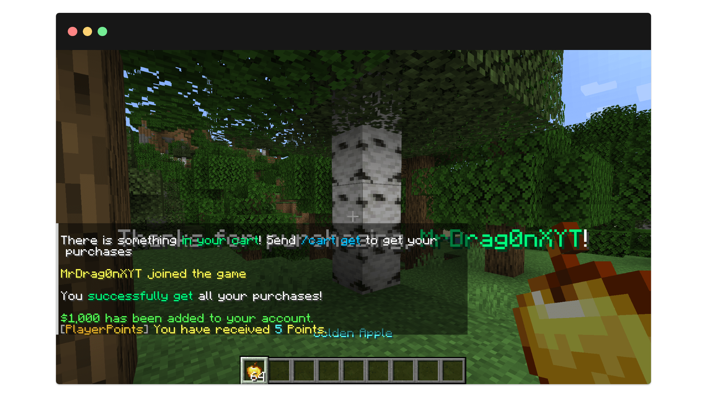
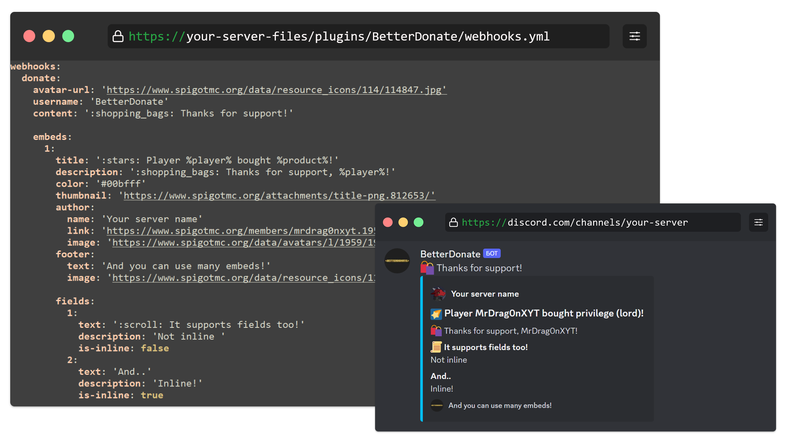

<div align="center">
<h5></h5>
</div>

**BetterDonate** - A plugin for Spigot that adds a shopping cart for players

<hr>

# [Версия на русском](README-RU.md)

<hr>

# 🌠 Features
- [x] Support for different types of products with customization of commands for issuing:
   - donate-group (e.g. LuckPerms)
   - money (e.g. Vault)
   - tokens (e.g. PlayerPoints)
   - own commands
- [x] Customize commands that executed on getting purchases by player.
- [x] Notification of the player about not picked up purchases when logging in to the server
- [x] Placeholder with the number of purchases
- [x] Webhook message on giving product to Discord

<hr>
<br>

# 📷 Screenshots

Easy to use command for give


On join non empty cart alert


Get all purchases on one command


Easy but powerful configuration


Discord messages on purchasement


<hr>
<br>

# 🚀 Usage

## Commands:

### `/betterdonate` - main command of this plugin

> Permisson: **betterdonate.admin**

Commands list:

- `/betterdonate help` - show command list
- `/betterdonate reload` - reload plugin
- `/betterdonate clear <player>` - clear player's cart
- `/betterdonate give <player> <product type> <argument>` - give a purchase to player
  - Example of use: `/betterdonate give Player123 donate vip`

### `/cart` - command for players

> Permisson: **betterdonate.cart**

Commands list:

- `/cart help` - show command list
- `/cart get` - get purchases

<br>

## 💾 Placeholders:
### **%betterdonate_purchases_count%** - returns count of player purchases

<br>

## 🛒 Products:

### List of available products for dispensing:

- **donate-group (e.g., LuckPerms)**
  - Example of use: `/betterdonate give Player123 donate vip`
- **money (e.g., Vault)**
  - Example of use: `/betterdonate give Player123 money 1000`
- **tokens (e.g., PlayerPoints)**
  - Example of use: `/betterdonate give Player123 tokens 1`
- **any commands executed by console**
  - Example of use: `/betterdonate give Player123 give Player123 minecraft:diamond 64`

> [!TIP]
> The commands to issue are configured in [config.yml](src/main/resources/config.yml)

<hr>
<br>

# ⚙ Other information

- If you find a bug or want to help with development, feel free to contact me
  - Contact links [here](https://slv.nshard.fun/) 
- You can also (optionally) donate me:
  - [DonationAlerts](https://www.donationalerts.com/r/mrdrag0nxyt)
  - TON: ```UQAwUJ_DWQ26_b94mFAy0bE1hrxVRHrq51umphFPreFraVL2```
